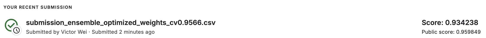
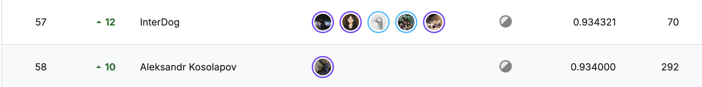

# IEEE-CIS Fraud Detection Competition

**Competition Link**: [IEEE-CIS Fraud Detection | Kaggle](https://www.kaggle.com/competitions/ieee-fraud-detection)

**Final Ranking: top 1% solution (58th out of 6,355)**  
**Best Submission Score: 0.934238 (Private) | 0.959849 (Public)**




## Overview

This repository contains my solution for the IEEE-CIS Fraud Detection competition, where the goal was to predict the probability that an online transaction is fraudulent. The challenge involved working with a complex dataset containing transaction and identity information with anonymized features.

## Business Context & Problem Statement

Online fraud detection is critical for financial institutions and payment processors. The dataset represents real-world e-commerce transactions with the following characteristics:

- **Transaction Data**: Contains payment information, transaction amounts, product categories, and temporal features
- **Identity Data**: Device and network information associated with transactions
- **Target**: Binary classification (fraudulent vs legitimate transactions)
- **Challenge**: Highly imbalanced dataset with anonymized features requiring careful feature engineering

## Project Structure

```
├── data/
│   ├── processed/          # Cleaned and engineered datasets
│   └── raw/               # Original competition data
├── notebooks/
│   ├── 01_EDA_and_insights.ipynb
│   ├── 02_Feature_Engineering.ipynb
│   ├── 03_imbalance_experiments.ipynb
│   ├── 03_IsoForest.ipynb
│   ├── 03_OneClassSVM.ipynb
│   ├── 04a_lgbm_optuna.ipynb
│   ├── 04b_xgb_time.ipynb
│   ├── 04b_xgb.ipynb
│   ├── 04c_cat.ipynb
│   ├── 04d_DL.ipynb
│   ├── 05_ensemble.ipynb
│   └── submissions/       # Final submission files
└── reports/               # Feature analysis and stability reports
```

## Methodology

### 1. Exploratory Data Analysis (EDA)
- Analyzed transaction patterns and fraud distributions
- Investigated temporal aspects of the data
- Identified key business relationships between features

### 2. Feature Engineering

The feature engineering strategy focused on creating business-meaningful features that capture fraud patterns:

#### Core Transaction Features
- **Transaction Amount Analysis**: Created statistical aggregations by card, address, and email domain
- **Temporal Features**: Extracted time-based patterns (holidays, weekdays, hours)
- **Product Categories**: Analyzed transaction patterns by product type

#### Identity & Device Features
- **Device Fingerprinting**: Parsed device information for type and version
- **Unique Identifiers**: Created composite UIDs from card, address, and email combinations
- **Behavioral Aggregations**: Statistical summaries of user behavior patterns

#### Advanced Feature Engineering
- **Frequency Encoding**: Encoded categorical variables by their frequency of occurrence
- **Target Encoding**: Created mean/std aggregations of numerical features by categorical groups
- **Temporal Consistency**: Analyzed feature stability across different time periods
- **Outlier Detection**: Identified anomalous transaction patterns

### 3. Model Development

#### Individual Models

**LightGBM Model**
- **Features**: 498 features including all V-columns and extensive feature engineering
- **Cross-Validation**: GroupKFold stratified by card1 to prevent data leakage
- **Hyperparameter Tuning**: Optuna optimization
- **CV Score**: 0.9427

**XGBoost Model**  
- **Features**: 238 carefully selected features focusing on high-impact signals
- **Strategy**: More aggressive feature selection to reduce overfitting
- **Cross-Validation**: Both GroupKFold and TimeSeriesSplit validation
- **CV Score**: 0.9551 (GroupKFold), 0.8566 (TimeSeriesSplit)

**CatBoost Model**
- **Features**: Similar feature set to XGBoost with categorical feature handling
- **CV Score**: 0.9311

#### Key Feature Categories

**XGBoost Feature Set (238 features)**:
- **Core Transaction**: TransactionAmt, ProductCD, card features (card1-6)
- **Address & Email**: addr1/2, P_emaildomain, R_emaildomain  
- **Counts & Frequency**: C1-C14 (transaction counts)
- **Time Deltas**: D1-D15 (days between previous transactions)
- **Browser/Device**: M1-M9 (match features)
- **Vesta Features**: Selected V-columns (high-signal anonymous features)
- **Identity**: Selected id_ features
- **Engineered**: Frequency encodings, aggregations, temporal features

**LightGBM Feature Set (498 features)**:
- **Comprehensive V-Features**: All V1-V339 columns (Vesta engineered features)
- **Complete Identity Set**: All id_01-id_38 features
- **Extensive Aggregations**: Mean/std by multiple grouping combinations
- **Temporal Engineering**: Time-based statistical features
- **Advanced UIDs**: Multiple user identification strategies

### 4. Cross-Validation Strategy

The competition highlighted a crucial decision between two validation approaches:

**GroupKFold (Competition Winner)**
- Grouped by card1 to prevent card-level data leakage
- Higher CV scores across all models
- Better performance on competition test set
- Potential for overfitting to specific data distribution

**TimeSeriesSplit (Real-World Robust)**
- Chronological splits respecting temporal order
- Lower CV scores but more realistic
- Better generalization to future unseen data
- More trustworthy for production deployment

### 5. Ensemble Strategy

The final solution used an optimized weighted ensemble:

```json
{
  "ensemble_method": "Optimized Weights",
  "final_cv_score": 0.9566,
  "model_weights": {
    "lgbm": 0.323,
    "xgb": 0.677,
    "catboost": 0.0
  },
  "individual_scores": {
    "lgbm": 0.9427,
    "xgb": 0.9551,
    "catboost": 0.9311
  }
}
```

The ensemble optimization determined that CatBoost added no value and the optimal combination was approximately 1/3 LightGBM and 2/3 XGBoost.

## Key Insights & Business Value

### Feature Importance Insights
1. **Transaction Amount Patterns**: Aggregated statistics by card/address combinations were highly predictive
2. **Temporal Behavior**: Time-based features captured normal vs suspicious transaction timing
3. **Device Consistency**: Device and browser information provided strong fraud signals
4. **User Behavior**: Aggregated user patterns across multiple dimensions identified anomalies

### Cross-Validation Learnings
The competition revealed a fundamental tension in machine learning competitions:
- **Competition Strategy**: GroupKFold maximized leaderboard performance by leveraging specific test set characteristics
- **Production Strategy**: TimeSeriesSplit would be more reliable for real-world deployment with truly unseen future data

### Business Applications
This fraud detection system could be deployed to:
- Real-time transaction scoring for payment processors
- Risk assessment for e-commerce platforms  
- Adaptive fraud rules based on behavioral patterns
- Customer verification workflows

## Technical Implementation

### Environment Setup
```bash
conda env create -f environment.yml
conda activate fraud-detection
```

### Model Training Pipeline
1. **Data Preprocessing**: Feature engineering and cleaning
2. **Model Training**: Individual model training with cross-validation
3. **Ensemble Optimization**: Weight optimization for model combination
4. **Submission Generation**: Final predictions on test set

### Key Libraries
- **scikit-learn**: Cross-validation and preprocessing
- **LightGBM**: Primary gradient boosting model
- **XGBoost**: Secondary gradient boosting model  
- **CatBoost**: Additional ensemble member
- **Optuna**: Hyperparameter optimization
- **Pandas/NumPy**: Data manipulation

## Results & Performance

| Model | CV Score | Final Ensemble Weight |
|-------|----------|----------------------|
| XGBoost | 0.9551 | 67.7% |
| LightGBM | 0.9427 | 32.3% |
| CatBoost | 0.9311 | 0% |
| **Ensemble** | **0.9566** | **100%** |

**Competition Performance**:
- Private Score: 0.934238
- Public Score: 0.959849
- Final Ranking: 58/6,355 (Top 1%)

## Lessons Learned

1. **Feature Engineering Impact**: Thoughtful business-driven feature engineering was more valuable than complex model architectures
2. **Validation Strategy**: The choice between GroupKFold and TimeSeriesSplit significantly impacted both competition performance and real-world applicability
3. **Ensemble Benefits**: Model diversity through different feature sets improved final performance
4. **Competition vs Production**: Strategies that win competitions may not always be optimal for production deployment

## Future Improvements

1. **Real-Time Features**: Incorporate streaming aggregations for production deployment
2. **Explainability**: Add SHAP analysis for model interpretability
3. **Drift Detection**: Monitor feature and target distribution changes over time
4. **A/B Testing Framework**: Systematic evaluation of model updates in production

## Repository Navigation

- `notebooks/01_EDA_and_insights.ipynb`: Initial data exploration and business insights
- `notebooks/02_Feature_Engineering.ipynb`: Comprehensive feature creation pipeline
- `notebooks/04a_lgbm_optuna.ipynb`: LightGBM model with hyperparameter optimization
- `notebooks/04b_xgb.ipynb`: XGBoost model development
- `notebooks/04c_cat.ipynb`: CatBoost model training
- `notebooks/05_ensemble.ipynb`: Final ensemble optimization and submission generation